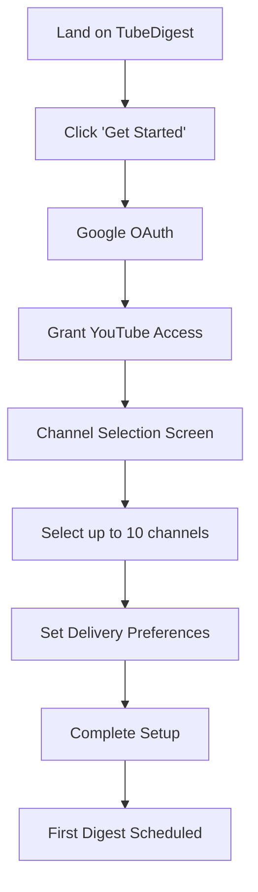
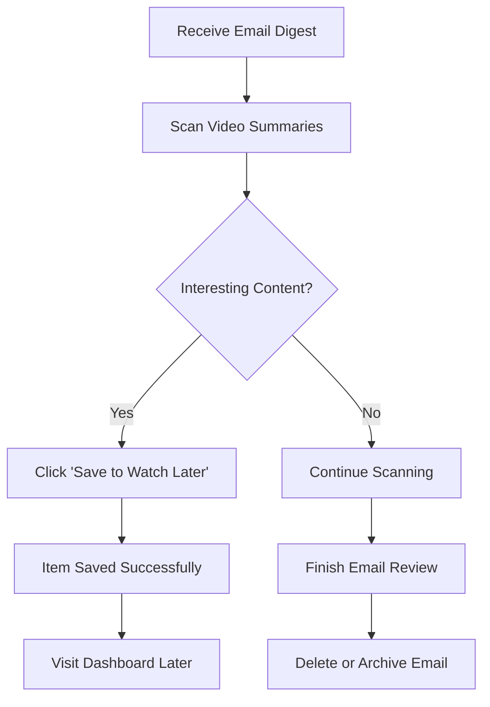
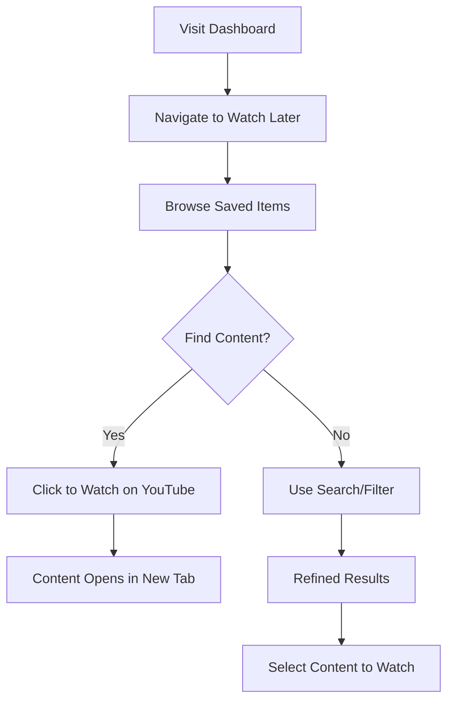

# TubeDigest Front End Specification

*Created by: UX Expert (Sally)*  
*Date: August 14, 2025*  
*Version: 1.0*

## Executive Summary

TubeDigest requires a **"scan and decide"** user experience that prioritizes email-first digest consumption with a supporting web dashboard. The interface must be optimized for rapid content triage, minimal cognitive load, and seamless cross-device usage.

**Key UX Principles:**
- **Email-First Design**: Primary interaction happens in email clients
- **Minimal Friction**: Maximum 2 clicks to save content or take action
- **Scannable Content**: Visual hierarchy optimized for rapid consumption
- **Cross-Device Consistency**: Seamless experience from email to web dashboard

## User Research & Personas

### Primary Persona: The Learning Optimizer
- **Demographics**: 25-45, tech-savvy professionals and lifelong learners
- **Behavior**: Follows 5-15 educational YouTube channels, values time efficiency
- **Pain Points**: Information overload, missed important content, time wasted on low-value videos
- **Goals**: Stay informed, maximize learning ROI, maintain knowledge of latest trends

### User Journey Mapping

#### Current State (Without TubeDigest)
1. **Discovery**: Random browsing of subscriptions
2. **Decision**: Unclear which videos are worth time investment
3. **Consumption**: Often watches entire videos to extract key points
4. **Organization**: No systematic way to save or categorize content

#### Future State (With TubeDigest)
1. **Receive**: Daily digest email with summaries
2. **Scan**: Quick review of titles, summaries, and chapters
3. **Decide**: Save interesting content to Watch Later
4. **Consume**: Watch saved content with context from summaries

## Information Architecture

### Site Map
```
TubeDigest Web Application
├── Authentication
│   ├── Google OAuth Login
│   └── Account Setup
├── Channel Management
│   ├── Channel Discovery
│   ├── Channel Selection (Max 10)
│   └── Preferences Settings
├── Dashboard
│   ├── Latest Digest View
│   ├── Watch Later List
│   ├── Search & Filter
│   └── Digest Archive
└── Settings
    ├── Delivery Schedule
    ├── Time Zone
    └── Email Preferences
```

### Content Hierarchy

#### Email Digest Structure
1. **Header**: Branding, date, digest summary
2. **Video Cards**: Title, channel, summary, chapters, CTAs
3. **Footer**: Unsubscribe, web view link, settings

#### Dashboard Structure
1. **Navigation**: Primary tabs (Latest, Watch Later, Search, Settings)
2. **Content Area**: Grid/list view of video cards
3. **Sidebar**: Filters, recent digests, quick stats

## User Flows

### Flow 1: First-Time User Onboarding


### Flow 2: Daily Digest Consumption


### Flow 3: Watch Later Management


## Screen Designs & Wireframes

### 1. Email Digest Template

#### Email Header
```
[TubeDigest Logo]     Your Daily Digest - [Date]     [View in Browser]
                                                      [Settings]
```

#### Video Card Layout (Email)
```
┌─────────────────────────────────────────────────────────────┐
│ [📺 Channel Icon] Channel Name • 2h ago                      │
│                                                             │
│ Video Title (Truncated if necessary...)                     │
│                                                             │
│ 📝 Summary: This video covers the key concepts of...        │
│    [First paragraph covering main topic and approach]      │
│                                                             │
│    [Second paragraph with key insights and takeaways]      │
│                                                             │
│    [Optional third paragraph for additional context]       │
│                                                             │
│ 🎯 Chapters (showing 8 of 12):                             │
│ • 00:00 Introduction & Overview                             │
│ • 02:15 Problem Statement                                   │
│ • 05:30 Core Concept Explanation                           │
│ • 09:45 First Implementation                                │
│ • 15:45 Advanced Techniques                                 │
│ • 22:10 Common Pitfalls                                     │
│ • 28:30 Best Practices                                      │
│ • 35:20 Conclusion & Next Steps                            │
│ [View all chapters ↗]                                      │
│                                                             │
│ [▶️ Watch on YouTube] [⭐ Save to Watch Later]              │
└─────────────────────────────────────────────────────────────┘
```

#### Email Footer
```
───────────────────────────────────────────────────────────────
📊 Today's Digest: 5 videos from 4 channels
🕒 Estimated reading time: 3 minutes

[Manage Channels] [Change Schedule] [Unsubscribe]
TubeDigest • Making YouTube learning efficient
```

### 2. Web Dashboard - Latest Digest View

```
┌─────────────────────────────────────────────────────────────┐
│ [🏠 TubeDigest]   [Latest] [Watch Later] [Search] [Settings] │
├─────────────────────────────────────────────────────────────┤
│                                                             │
│ Today's Digest - August 14, 2025                           │
│ 📊 5 videos • 3 channels • ~2h 15m total content           │
│                                                             │
│ ┌─────────────┐ ┌─────────────┐ ┌─────────────┐           │
│ │   Video 1   │ │   Video 2   │ │   Video 3   │           │
│ │[Thumbnail]  │ │[Thumbnail]  │ │[Thumbnail]  │           │
│ │Title...     │ │Title...     │ │Title...     │           │
│ │Channel      │ │Channel      │ │Channel      │           │
│ │[Summary]    │ │[Summary]    │ │[Summary]    │           │
│ │[▶️][⭐]     │ │[▶️][⭐]     │ │[▶️][⭐]     │           │
│ └─────────────┘ └─────────────┘ └─────────────┘           │
│                                                             │
│ ┌─────────────┐ ┌─────────────┐                           │
│ │   Video 4   │ │   Video 5   │                           │
│ │[Thumbnail]  │ │[Thumbnail]  │                           │
│ │Title...     │ │Title...     │                           │
│ │Channel      │ │Channel      │                           │
│ │[Summary]    │ │[Summary]    │                           │
│ │[▶️][⭐]     │ │[▶️][⭐]     │                           │
│ └─────────────┘ └─────────────┘                           │
└─────────────────────────────────────────────────────────────┘
```

### 3. Watch Later Dashboard

```
┌─────────────────────────────────────────────────────────────┐
│ [🏠 TubeDigest]   [Latest] [Watch Later] [Search] [Settings] │
├─────────────────────────────────────────────────────────────┤
│                                                             │
│ Watch Later (12 items)              [🔍 Search saved items] │
│                                                             │
│ Filters: [📅 All Time ▼] [📺 All Channels ▼]               │
│                                                             │
│ ┌───────────────────────────────────────────────────────────┐ │
│ │ [Thumbnail] Video Title Here                        [❌] │ │
│ │ 📺 Channel Name • Saved 2 days ago                      │ │
│ │ 📝 Brief summary of the video content...                │ │
│ │ [▶️ Watch] [📋 View Full Summary & Chapters]            │ │
│ └───────────────────────────────────────────────────────────┘ │
│                                                             │
│ ┌───────────────────────────────────────────────────────────┐ │
│ │ [Thumbnail] Another Video Title                     [❌] │ │
│ │ 📺 Different Channel • Saved 1 week ago                 │ │
│ │ 📝 Summary text for this video...                       │ │
│ │ [▶️ Watch] [📋 View Full Summary & Chapters]            │ │
│ └───────────────────────────────────────────────────────────┘ │
└─────────────────────────────────────────────────────────────┘
```

### 4. Channel Selection Screen

```
┌─────────────────────────────────────────────────────────────┐
│ [🏠 TubeDigest]                              Step 2 of 3    │
├─────────────────────────────────────────────────────────────┤
│                                                             │
│ Select Your Channels (up to 10)                            │
│ Choose the channels you'd like to include in your digest   │
│                                                             │
│ [🔍 Search your subscriptions...]                          │
│                                                             │
│ Your Subscriptions:                   Selected: 3/10       │
│                                                             │
│ ┌─────────────────────────────────────┐                    │
│ │ [✅] [📺] Tech Channel Name           │ 📊 ~2 videos/week  │
│ │     Technology & Programming         │                   │
│ └─────────────────────────────────────┘                    │
│                                                             │
│ ┌─────────────────────────────────────┐                    │
│ │ [✅] [📺] Learning Channel            │ 📊 ~1 video/week  │
│ │     Education & Tutorials            │                   │
│ └─────────────────────────────────────┘                    │
│                                                             │
│ ┌─────────────────────────────────────┐                    │
│ │ [✅] [📺] Science Explained           │ 📊 ~3 videos/week  │
│ │     Science & Research               │                   │
│ └─────────────────────────────────────┘                    │
│                                                             │
│ ┌─────────────────────────────────────┐                    │
│ │ [  ] [📺] News Channel               │ 📊 ~5 videos/day  │
│ │     News & Politics                  │                   │
│ └─────────────────────────────────────┘                    │
│                                                             │
│                    [Previous] [Continue]                   │
└─────────────────────────────────────────────────────────────┘
```

## Email Template Design

### Design Priorities
1. **Mobile-First**: 60%+ of email opens are on mobile
2. **Dark Mode Compatible**: Support for dark mode email clients
3. **Client Compatibility**: Works across Gmail, Outlook, Apple Mail, etc.
4. **Loading Speed**: Optimized images and minimal external resources

### Email Template Specifications

#### Header Section
- **Brand Recognition**: TubeDigest logo + tagline
- **Date Context**: Clear digest date and timeframe
- **Quick Actions**: Settings and web view links

#### Content Cards
- **Visual Hierarchy**: Channel icon → Title → Summary → Chapters → Actions
- **Scannable Format**: Bullet points for chapters with timestamps
- **Clear CTAs**: Distinct buttons for "Watch" vs "Save"
- **Progressive Enhancement**: Fallback text for images

#### Responsive Breakpoints
- **Mobile (320-480px)**: Single column, stacked cards
- **Tablet (481-768px)**: Single column, more padding
- **Desktop (768px+)**: Full layout with sidebar potential

### Email HTML Structure
```html
<!DOCTYPE html>
<html>
<head>
    <meta charset="utf-8">
    <meta name="viewport" content="width=device-width, initial-scale=1.0">
    <title>Your Daily TubeDigest</title>
    <style>
        /* CSS custom properties from design system */
        :root {
            --primary-500: #667eea;
            --gray-600: #4b5563;
            --space-4: 1rem;
        }
        
        /* Email-specific styles */
        .email-container {
            max-width: 600px;
            margin: 0 auto;
            font-family: -apple-system, BlinkMacSystemFont, 'Segoe UI', sans-serif;
        }
        
        .video-card {
            background: #ffffff;
            border-radius: 12px;
            padding: 24px;
            margin-bottom: 20px;
            border: 1px solid #e5e7eb;
        }
        
        .cta-button {
            background-color: var(--primary-500);
            color: white;
            padding: 12px 24px;
            border-radius: 8px;
            text-decoration: none;
            display: inline-block;
            margin: 8px 8px 8px 0;
        }
        
        /* Dark mode support */
        @media (prefers-color-scheme: dark) {
            .video-card {
                background: #1f2937;
                border-color: #374151;
                color: #f9fafb;
            }
        }
    </style>
</head>
<!-- Email body content -->
</html>
```

## Responsive Design Strategy

### Mobile-First Approach
- **Base Design**: Optimized for 375px (iPhone standard)
- **Touch Targets**: Minimum 44px for all interactive elements
- **Thumb-Friendly**: Important actions within easy reach
- **Performance**: Lazy loading for below-the-fold content

### Breakpoint Strategy
```css
/* Mobile (Default) */
.video-grid {
    grid-template-columns: 1fr;
    gap: var(--space-4);
}

/* Tablet */
@media (min-width: 768px) {
    .video-grid {
        grid-template-columns: repeat(2, 1fr);
        gap: var(--space-6);
    }
}

/* Desktop */
@media (min-width: 1024px) {
    .video-grid {
        grid-template-columns: repeat(3, 1fr);
    }
    
    .dashboard-layout {
        display: grid;
        grid-template-columns: 250px 1fr;
        gap: var(--space-8);
    }
}
```

### Progressive Enhancement
1. **Core Experience**: Works without JavaScript
2. **Enhanced Experience**: JavaScript adds animations and interactions
3. **Advanced Features**: Search suggestions, infinite scroll, etc.

## Interaction Design

### Micro-Interactions

#### Save to Watch Later Animation
```css
@keyframes saveSuccess {
    0% { transform: scale(1); }
    50% { transform: scale(1.1); }
    100% { transform: scale(1); background-color: var(--success-500); }
}

.save-button.saved {
    animation: saveSuccess 0.3s ease;
}
```

#### Loading States
- **Skeleton Screens**: For initial page loads
- **Progressive Loading**: Content appears as it loads
- **Optimistic UI**: Immediate feedback for user actions

#### Hover States
- **Video Cards**: Subtle lift with shadow increase
- **Buttons**: Color transition + slight scale
- **Links**: Underline animation

### Gesture Support (Mobile)
- **Swipe to Save**: Swipe right on video cards to save
- **Pull to Refresh**: Refresh latest digest
- **Long Press**: Context menu for additional actions

### Keyboard Navigation
- **Tab Order**: Logical navigation through interface
- **Keyboard Shortcuts**:
  - `S` - Save current item to Watch Later
  - `/` - Focus search
  - `Esc` - Close modals/clear search
  - `Arrow Keys` - Navigate between items

## Accessibility Requirements

### WCAG 2.1 AA Compliance

#### Color & Contrast
- **Minimum Contrast**: 4.5:1 for normal text
- **Large Text**: 3:1 for 18px+ text
- **Color Independence**: Information not conveyed by color alone

#### Focus Management
- **Visible Focus**: All interactive elements have clear focus indicators
- **Focus Order**: Logical tab sequence
- **Focus Trapping**: Modals trap focus appropriately

#### Screen Reader Support
```html
<!-- Semantic HTML Structure -->
<main role="main" aria-label="Digest content">
    <section aria-labelledby="digest-heading">
        <h1 id="digest-heading">Today's Digest - August 14, 2025</h1>
        
        <article aria-labelledby="video-1-title">
            <h2 id="video-1-title">Video Title</h2>
            <p aria-label="Video summary">Summary content...</p>
            
            <button aria-label="Save 'Video Title' to Watch Later">
                <span aria-hidden="true">⭐</span>
                Save to Watch Later
            </button>
        </article>
    </section>
</main>

<!-- Live regions for dynamic updates -->
<div aria-live="polite" aria-atomic="true" id="save-notifications"></div>
```

#### Image Alternative Text
- **Thumbnails**: "Video thumbnail for [Video Title] by [Channel Name]"
- **Icons**: Descriptive text or aria-hidden when decorative
- **Charts/Graphics**: Detailed alt text or data tables

### Keyboard Accessibility
```javascript
// Example: Keyboard navigation for video cards
function handleKeyNavigation(event) {
    const currentCard = event.target.closest('.video-card');
    const allCards = document.querySelectorAll('.video-card');
    const currentIndex = Array.from(allCards).indexOf(currentCard);
    
    switch(event.key) {
        case 'ArrowDown':
            focusCard(currentIndex + 1);
            event.preventDefault();
            break;
        case 'ArrowUp':
            focusCard(currentIndex - 1);
            event.preventDefault();
            break;
        case 'Enter':
        case ' ':
            handleCardAction(currentCard);
            event.preventDefault();
            break;
    }
}
```

## Performance Considerations

### Core Web Vitals Targets
- **Largest Contentful Paint (LCP)**: < 2.5s
- **First Input Delay (FID)**: < 100ms
- **Cumulative Layout Shift (CLS)**: < 0.1

### Optimization Strategies

#### Image Optimization
```html
<!-- Responsive images with WebP support -->
<picture>
    <source srcset="thumbnail-400.webp 400w, thumbnail-800.webp 800w" 
            type="image/webp">
    
</picture>
```

#### Code Splitting
```javascript
// Lazy load dashboard components
const WatchLaterPage = lazy(() => import('./pages/WatchLaterPage'));
const SearchPage = lazy(() => import('./pages/SearchPage'));

// Route-based code splitting
function App() {
    return (
        <Suspense fallback={<LoadingSpinner />}>
            <Routes>
                <Route path="/watch-later" element={<WatchLaterPage />} />
                <Route path="/search" element={<SearchPage />} />
            </Routes>
        </Suspense>
    );
}
```

#### Caching Strategy
- **Static Assets**: Long-term caching with versioning
- **API Responses**: Short-term caching for digest data
- **Images**: CDN with automatic optimization
- **Service Worker**: Cache critical resources offline

### Email Performance
- **Image Optimization**: Compressed thumbnails < 50KB each
- **Minimal CSS**: Inline critical styles only
- **Fallback Content**: Text-only version for slow connections
- **External Resources**: Minimal external dependencies

## Implementation Guidelines

### Component Architecture

#### Atomic Design Structure
```
src/components/
├── atoms/
│   ├── Button.tsx
│   ├── Icon.tsx
│   ├── Typography.tsx
│   └── Input.tsx
├── molecules/
│   ├── VideoCard.tsx
│   ├── SearchBar.tsx
│   ├── ChapterList.tsx
│   └── SaveButton.tsx
├── organisms/
│   ├── DigestGrid.tsx
│   ├── Navigation.tsx
│   ├── WatchLaterList.tsx
│   └── EmailTemplate.tsx
├── templates/
│   ├── DashboardLayout.tsx
│   ├── DigestEmailLayout.tsx
│   └── AuthLayout.tsx
└── pages/
    ├── Dashboard.tsx
    ├── WatchLater.tsx
    ├── Settings.tsx
    └── ChannelSelection.tsx
```

#### Component Props Interface
```typescript
// VideoCard component interface
interface VideoCardProps {
    video: {
        id: string;
        title: string;
        channel: string;
        summaryParagraphs: string[]; // 2-3 paragraphs for richer context
        chapters: Chapter[]; // Full chapter list, UI shows first 10-15 max
        thumbnail: string;
        url: string;
        duration: number;
    };
    onSave: (videoId: string) => void;
    onWatch: (videoId: string) => void;
    isSaved?: boolean;
    variant?: 'email' | 'dashboard' | 'compact';
    maxChaptersShown?: number; // Default 10, max 15
}

// Chapter interface
interface Chapter {
    id: string;
    title: string;
    startTime: number;
    endTime: number;
}
```

### State Management
```typescript
// Global state structure
interface AppState {
    user: {
        id: string;
        email: string;
        timezone: string;
        preferences: UserPreferences;
    };
    digest: {
        latest: DigestData;
        archive: DigestData[];
        loading: boolean;
        error: string | null;
    };
    watchLater: {
        items: WatchLaterItem[];
        loading: boolean;
        filters: FilterState;
    };
    channels: {
        selected: Channel[];
        available: Channel[];
        loading: boolean;
    };
}
```

### Email Template Implementation
```typescript
// Email template generator
export function generateDigestEmail(
    user: User,
    videos: VideoSummary[],
    digestId: string
): string {
    const template = `
        <!DOCTYPE html>
        <html>
        <head>
            ${getEmailHead()}
        </head>
        <body>
            ${getEmailHeader(user, new Date())}
            ${videos.map(video => getVideoCard(video, digestId)).join('')}
            ${getEmailFooter(user)}
        </body>
        </html>
    `;
    
    return minifyHtml(template);
}

function getVideoCard(video: VideoSummary, digestId: string): string {
    return `
        <div class="video-card">
            <div class="video-header">
                
                <span class="channel-name">${video.channelName}</span>
                <span class="publish-time">${formatTime(video.publishedAt)}</span>
            </div>
            
            <h2 class="video-title">${video.title}</h2>
            
            <div class="video-summary">
                ${video.summaryParagraphs.map(paragraph => 
                    `<p>${paragraph}</p>`
                ).join('')}
            </div>
            
            <div class="video-chapters">
                <h3>Chapters${video.chapters.length > 10 ? ` (showing 10 of ${video.chapters.length})` : ''}:</h3>
                <ul>
                    ${video.chapters.slice(0, 10).map(chapter => 
                        `<li>${formatTimestamp(chapter.startTime)} ${chapter.title}</li>`
                    ).join('')}
                    ${video.chapters.length > 10 ? 
                        `<li class="view-all"><a href="${getFullChaptersUrl(video.id)}">View all ${video.chapters.length} chapters ↗</a></li>` 
                        : ''
                    }
                </ul>
            </div>
            
            <div class="video-actions">
                <a href="${video.youtubeUrl}" class="cta-button watch-button">
                    ▶️ Watch on YouTube
                </a>
                <a href="${getSaveUrl(video.id, digestId)}" class="cta-button save-button">
                    ⭐ Save to Watch Later
                </a>
            </div>
        </div>
    `;
}
```

### Testing Strategy

#### Visual Regression Testing
```javascript
// Example Playwright test for email template
test('digest email renders correctly', async ({ page }) => {
    await page.goto('/email-preview/latest');
    
    // Test desktop view
    await page.setViewportSize({ width: 1200, height: 800 });
    await expect(page).toHaveScreenshot('digest-email-desktop.png');
    
    // Test mobile view
    await page.setViewportSize({ width: 375, height: 667 });
    await expect(page).toHaveScreenshot('digest-email-mobile.png');
    
    // Test dark mode
    await page.emulateMedia({ colorScheme: 'dark' });
    await expect(page).toHaveScreenshot('digest-email-dark.png');
});
```

#### Accessibility Testing
```javascript
// Example accessibility test
test('digest page is accessible', async ({ page }) => {
    await page.goto('/dashboard');
    
    // Test keyboard navigation
    await page.keyboard.press('Tab');
    await expect(page.locator(':focus')).toBeVisible();
    
    // Test screen reader content
    const pageTitle = await page.locator('h1').textContent();
    expect(pageTitle).toContain('Digest');
    
    // Test color contrast
    await injectAxe(page);
    const results = await checkA11y(page);
    expect(results.violations).toHaveLength(0);
});
```

## Next Steps & Recommendations

### Phase 1: Core Implementation (Weeks 1-2)
1. **Email Template**: Create and test responsive digest email
2. **Dashboard Layout**: Implement basic dashboard with navigation
3. **Video Cards**: Build reusable video card component
4. **Save Functionality**: Implement Watch Later saving

### Phase 2: Enhanced Features (Weeks 3-4)
1. **Search Interface**: Add search and filtering
2. **Responsive Refinement**: Optimize mobile experience
3. **Accessibility**: Implement full WCAG compliance
4. **Performance**: Optimize loading and interactions

### Phase 3: Polish & Testing (Week 5)
1. **Cross-Browser Testing**: Ensure compatibility
2. **Email Client Testing**: Test across email platforms
3. **User Testing**: Conduct usability testing
4. **Performance Audit**: Final optimization pass

### Future Roadmap: Enhanced Watch Later (Post-MVP)
**Notion-like Organization Features:**
- **Custom Categories**: User-defined folders/categories for saved content
- **Tagging System**: Multiple tags per video (e.g., "tutorial", "reference", "priority")
- **Smart Collections**: Auto-categorization based on content analysis
- **Advanced Search**: Filter by tags, categories, date ranges, duration
- **Bulk Operations**: Move, tag, or organize multiple items at once
- **Progress Tracking**: Mark videos as "in progress" or "completed"

*Note: MVP implementation focuses on simple Save/Remove functionality to validate core user behavior before adding complexity.*

### Design Handoff Assets
1. **Component Library**: Figma/Sketch file with all components
2. **Style Guide**: CSS custom properties and utility classes
3. **Icon Set**: SVG icons optimized for web and email
4. **Email Templates**: HTML/CSS templates for development
5. **Accessibility Checklist**: QA checklist for accessibility compliance

---

*This Front End Specification provides the foundation for implementing a user-centered, accessible, and performant interface for TubeDigest. The design prioritizes the core user journey of efficient content consumption while maintaining flexibility for future enhancements.*
