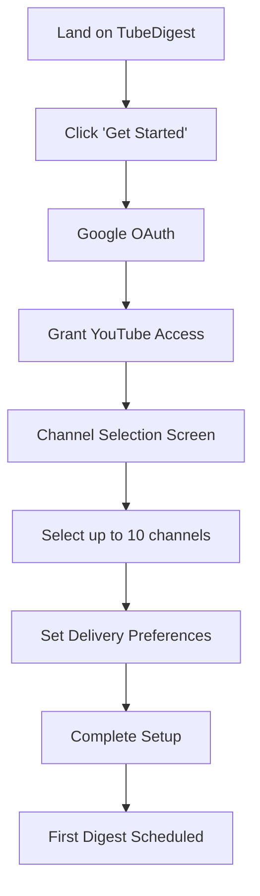
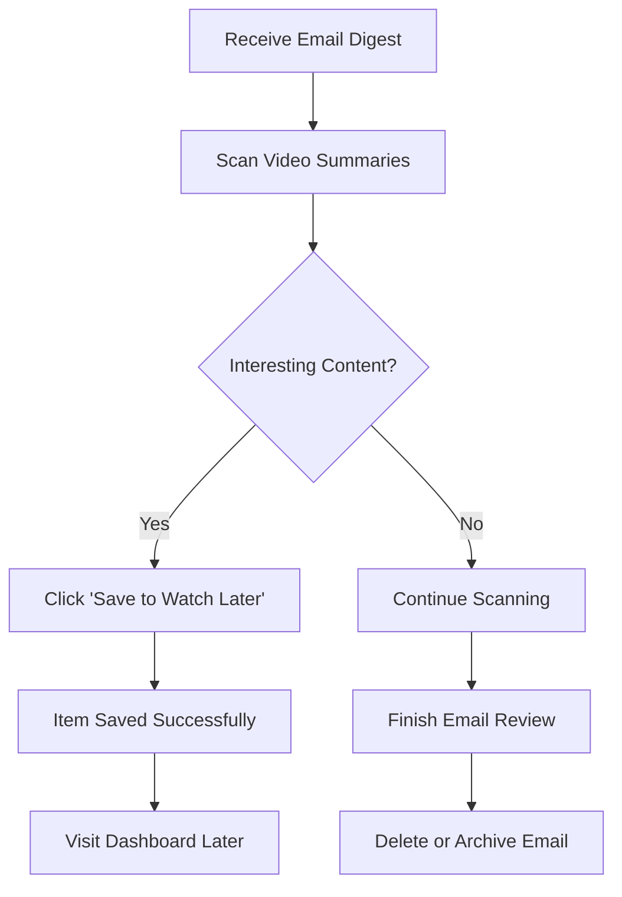
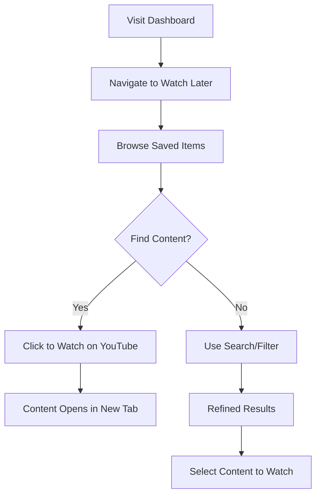

# User Flows

## Flow 1: First-Time User Onboarding

```mermaid
flowchart TD
    A[Land on TubeDigest] --> B[Click 'Get Started']
    B --> C[Google OAuth]
    C --> D[Grant YouTube Access]
    D --> E[Channel Selection Screen]
    E --> F[Select up to 10 channels]
    F --> G[Set Delivery Preferences]
    G --> H[Complete Setup]
    H --> I[First Digest Scheduled]
```

## Flow 2: Daily Digest Consumption

```mermaid
flowchart TD
    A[Receive Email Digest] --> B[Scan Video Summaries]
    B --> C{Interesting Content?}
    C -->|Yes| D[Click 'Save to Watch Later']
    C -->|No| E[Continue Scanning]
    D --> F[Item Saved Successfully]
    E --> G[Finish Email Review]
    F --> H[Visit Dashboard Later]
    G --> I[Delete or Archive Email]
```

## Flow 3: Watch Later Management

```mermaid
flowchart TD
    A[Visit Dashboard] --> B[Navigate to Watch Later]
    B --> C[Browse Saved Items]
    C --> D{Find Content?}
    D -->|Yes| E[Click to Watch on YouTube]
    D -->|No| F[Use Search/Filter]
    E --> G[Content Opens in New Tab]
    F --> H[Refined Results]
    H --> I[Select Content to Watch]
```
