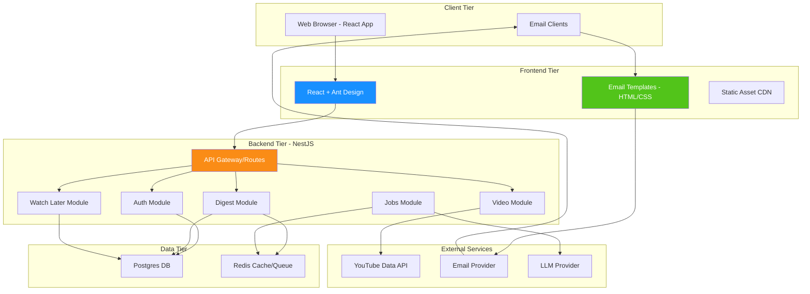

# System Architecture Overview

```mermaid
graph TB
    subgraph "Client Tier"
        A[Email Clients] 
        B[Web Browser - React App]
    end
    
    subgraph "Frontend Tier"
        C[React + Ant Design]
        D[Email Templates - HTML/CSS]
        E[Static Asset CDN]
    end
    
    subgraph "Backend Tier - NestJS"
        F[API Gateway/Routes]
        G[Auth Module]
        H[Digest Module]
        I[Video Module]
        J[Watch Later Module]
        K[Jobs Module]
    end
    
    subgraph "Data Tier"
        L[Postgres DB]
        M[Redis Cache/Queue]
    end
    
    subgraph "External Services"
        N[YouTube Data API]
        O[Email Provider]
        P[LLM Provider]
    end
    
    A --> D
    B --> C
    C --> F
    D --> O
    F --> G
    F --> H
    F --> I
    F --> J
    G --> L
    H --> L
    H --> M
    I --> N
    J --> L
    K --> M
    O --> A
    K --> P
    
    style C fill:#1890ff,color:#fff
    style D fill:#52c41a,color:#fff
    style F fill:#fa8c16,color:#fff
```
